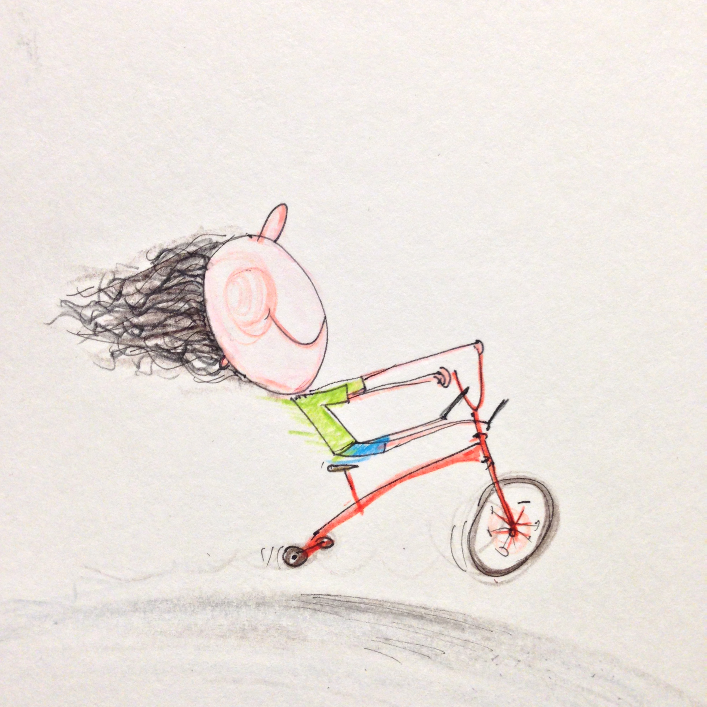

#About 15mindrawings

I started 15mindrawings as a side project in April 2014, as a way of entertaining our son on a rainy sunday afternoon. Given that all kids like colouring in I thought i would draw some of his favourite things to colour in. The squeals of excitement as I drew a digger in front of his eyes was infectious. It turns out, he didn't want to colour in, he just wanted me to draw more things for him. So by the end of that day,  I had drawn another digger a dump truck, a digger filling up a dumptruck and finally an aeroplane.

The following morning our son came into our bedroom clutching the crude drawings from the previous day, and was very excitedly telling us about the diggers, and the dump truck. At that moment that I knew I was going to be doing more drawings.

